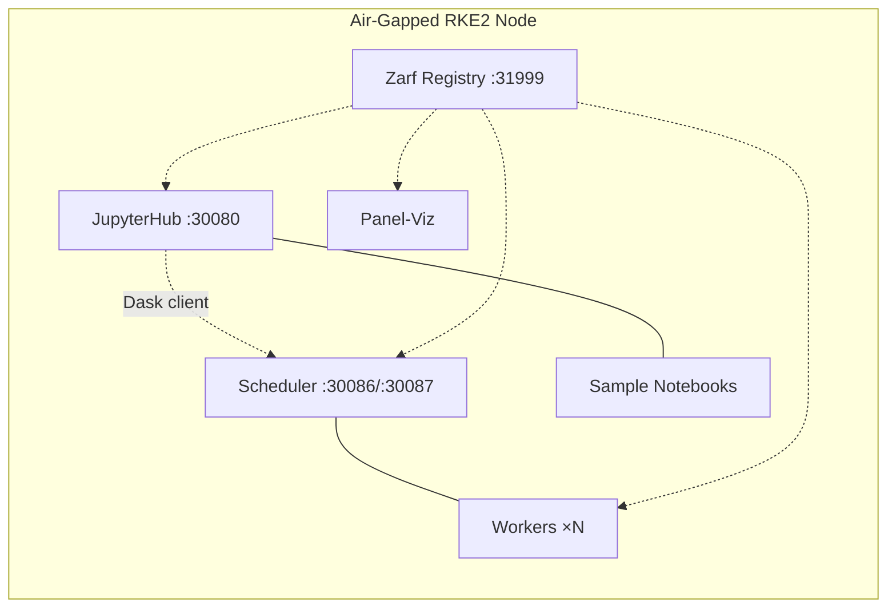

# Cyberphy Dask Air-Gap Deployment

Zarf package for deploying Dask + JupyterHub + Panel-Viz to air-gapped RKE2.

**Current release**: [`v1.4.0`](https://github.com/rch/cldr-cybersec/releases/tag/zarf-v1.4.0)

---

## Package Contents

| Component | Version | Description |
|-----------|---------|-------------|
| Dask Operator | 2024.1.0 | Manages DaskCluster CRDs |
| Dask Cluster | 2025.2.0 | Scheduler + workers with spill-to-disk |
| JupyterHub | 4.0.0 | Interactive notebooks, Dask-connected |
| Panel-Viz | 2025.2.0 | OTEL heatmap with smart windowing |
| Sample Notebooks | 2 | OTEL Data Generator, S3 Validation |

Container images baked into the `.tar.zst` (~1.3 GB total):

- `cybersec-dask:2025.2.0` — Dask + Panel + HoloViews + Datashader + s3fs
- `ghcr.io/dask/dask-kubernetes-operator:2024.1.0`
- `quay.io/jupyterhub/k8s-hub:4.0.0`
- `quay.io/jupyterhub/configurable-http-proxy:4.5.5`



---

## Deploy Variables

```bash
zarf package deploy zarf-package-cybersec-dask-amd64-1.4.0.tar.zst --confirm \
  --set S3_ENDPOINT=http://minio:9000 \
  --set S3_ACCESS_KEY=<key> \
  --set S3_SECRET_KEY=<secret> \
  --set DASK_SPILL_DIR=/mnt/nfs/dask-spill \
  --set DASK_WORKER_REPLICAS=4
```

| Variable | Default | Description |
|----------|---------|-------------|
| `DASK_WORKER_REPLICAS` | `4` | Number of Dask workers |
| `DASK_SPILL_DIR` | `/tmp/dask-spill` | Host path for worker spill-to-disk (NFS recommended) |
| `S3_ENDPOINT` | _(empty)_ | S3-compatible endpoint URL |
| `S3_ACCESS_KEY` | _(empty)_ | S3 access key (sensitive) |
| `S3_SECRET_KEY` | _(empty)_ | S3 secret key (sensitive) |
| `INGRESS_CLASS` | `traefik` | Ingress controller class |
| `INGRESS_DOMAIN` | `cyberphy.local` | Base domain for ingress |

---

## Quickstart (Pre-Built Release)

### Acquire artifacts (internet-connected machine)

| Artifact | How to get | Size |
|----------|-----------|------|
| `zarf` binary | [Zarf releases](https://github.com/zarf-dev/zarf/releases) (Linux amd64) | ~100 MB |
| `zarf-init-amd64-v0.70.1.tar.zst` | `zarf tools download-init` | ~300 MB |
| `zarf-package-cybersec-dask-amd64-1.4.0.tar.zst` | [GitHub Releases](https://github.com/rch/cldr-cybersec/releases/tag/zarf-v1.4.0) | ~1.3 GB |

```bash
# Download on a machine with internet access
curl -LO https://github.com/zarf-dev/zarf/releases/download/v0.70.1/zarf_v0.70.1_Linux_amd64
mv zarf_v0.70.1_Linux_amd64 zarf && chmod +x zarf
./zarf tools download-init
# Download cybersec-dask package from GitHub Releases (link above)
```

Transfer all three files to the air-gapped node (USB, SCP, data diode, etc.).

### Deploy (air-gapped node, RKE2 already running)

```bash
export KUBECONFIG=/etc/rancher/rke2/rke2.yaml
export PATH=$PATH:/var/lib/rancher/rke2/bin
sudo cp zarf /usr/local/bin/ && sudo chmod +x /usr/local/bin/zarf

# 1. Provision storage for Zarf's internal registry
sudo mkdir -p /var/lib/zarf-registry && sudo chmod 777 /var/lib/zarf-registry
sudo kubectl apply -f - <<'EOF'
apiVersion: v1
kind: PersistentVolume
metadata:
  name: zarf-registry-pv
spec:
  capacity:
    storage: 20Gi
  accessModes: [ReadWriteOnce]
  persistentVolumeReclaimPolicy: Retain
  hostPath:
    path: /var/lib/zarf-registry
    type: DirectoryOrCreate
  claimRef:
    namespace: zarf
    name: zarf-docker-registry
EOF

# 2. Initialize Zarf (init package must be in current directory)
sudo KUBECONFIG=/etc/rancher/rke2/rke2.yaml zarf init --confirm

# 3. Deploy
sudo KUBECONFIG=/etc/rancher/rke2/rke2.yaml zarf package deploy \
  zarf-package-cybersec-dask-amd64-1.4.0.tar.zst --confirm \
  --set DASK_SPILL_DIR=/mnt/nfs/dask-spill   # or /tmp/dask-spill
```

---

## Disk-Constrained Deployment (Disk-Light)

For nodes with limited local disk but NFS or shared storage available.

> **Do NOT use `--set REGISTRY_PVC_ENABLED=false`.**
> This disables the registry's storage driver entirely, causing the pod to
> crash with `"no storage configuration provided"`. The registry always needs
> real storage — either a PVC backed by a PV or a StorageClass provisioner.

**Key principle**: The Zarf registry requires **local disk** — it uses hard links
and atomic renames that NFS does not support. However, the registry only needs
~2 GB for this package, so a small hostPath PV (5 Gi) works even on heavily
constrained nodes. Dask spill-to-disk and user data should go on NFS.

### What goes where

| Data | Storage | Why |
|------|---------|-----|
| Zarf registry | **Local hostPath** (5 Gi) | Hard links + atomic renames required |
| RKE2 runtime | Local `/var/lib/rancher` | K8s requires local |
| Dask spill-to-disk | **NFS mount** | Large, ephemeral, shared across workers |
| JupyterHub notebooks | NFS mount (optional) | Persists across hub restarts |

### Using the deployment script

```bash
sudo ./scripts/verify-zarf-deployment.sh --skip-build --disk-light
```

This mode:
- Creates a **5 Gi hostPath PV** on local disk at `/var/lib/zarf-registry`
- Passes `--set REGISTRY_PVC_SIZE=5Gi` to `zarf init`
- Auto-cleans stuck PVCs from previous failed init attempts
- Post-deploy patches Dask spill volume to `emptyDir` (512Mi)
- Defaults `DASK_WORKER_REPLICAS=4`

**Auto-detection**: The script automatically enables disk-light mode when
`df /var/lib/rancher` shows <10% free or a `node.kubernetes.io/disk-pressure`
taint is detected.

### Manual disk-light deployment (with NFS spill)

```bash
export KUBECONFIG=/etc/rancher/rke2/rke2.yaml
export PATH=$PATH:/var/lib/rancher/rke2/bin

# 1. Create registry directory on LOCAL disk (not NFS!)
sudo mkdir -p /var/lib/zarf-registry
sudo chown 1000:2000 /var/lib/zarf-registry
sudo chmod 777 /var/lib/zarf-registry
sudo chcon -R -t container_file_t /var/lib/zarf-registry 2>/dev/null; true

# 2. Pre-create a small PV (5 Gi label, ~2 GB actual usage)
sudo kubectl apply -f - <<'EOF'
apiVersion: v1
kind: PersistentVolume
metadata:
  name: zarf-registry-pv
spec:
  capacity:
    storage: 5Gi
  accessModes: [ReadWriteOnce]
  persistentVolumeReclaimPolicy: Retain
  hostPath:
    path: /var/lib/zarf-registry
    type: DirectoryOrCreate
  claimRef:
    namespace: zarf
    name: zarf-docker-registry
EOF

# 3. Initialize Zarf with matching PVC size
sudo KUBECONFIG=/etc/rancher/rke2/rke2.yaml \
  zarf init --confirm --set REGISTRY_PVC_SIZE=5Gi

# 4. Deploy with NFS spill path
sudo KUBECONFIG=/etc/rancher/rke2/rke2.yaml zarf package deploy \
  zarf-package-cybersec-dask-amd64-1.4.0.tar.zst --confirm \
  --set DASK_SPILL_DIR=/mnt/nfs/dask-spill \
  --set DASK_WORKER_REPLICAS=4

# 5. Verify NFS spill is mounted in workers
sudo kubectl exec -n dask \
  $(sudo kubectl get pod -n dask -l dask.org/component=worker -o name | head -1) \
  -- df -h /dask-spill
```

### Manual disk-light deployment (no NFS)

If no NFS is available, use emptyDir for spill:

```bash
# Steps 1–3: same as above

# 4. Deploy without specifying DASK_SPILL_DIR
sudo KUBECONFIG=/etc/rancher/rke2/rke2.yaml zarf package deploy \
  zarf-package-cybersec-dask-amd64-1.4.0.tar.zst --confirm \
  --set DASK_WORKER_REPLICAS=4

# 5. Patch spill volume to emptyDir (512Mi)
sudo kubectl patch daskcluster cybersec-dask -n dask --type=json -p \
  '[{"op":"replace","path":"/spec/worker/spec/volumes/0","value":{"name":"dask-spill","emptyDir":{"sizeLimit":"512Mi"}}}]'
sudo kubectl delete pods -n dask -l dask.org/component=worker
```

### Disk budget reference

The Zarf registry, RKE2 runtime, and Kubernetes system together need local disk.
Everything else can live on NFS.

| Component | Local disk usage | Notes |
|-----------|-----------------|-------|
| RKE2 runtime | ~3-5 GB | `/var/lib/rancher` |
| Zarf registry | ~2 GB | `/var/lib/zarf-registry` (5 Gi PV label) |
| Zarf init package | ~300 MB | Temporary, consumed during init |
| Cyberphy package | ~1.3 GB | Temporary, consumed during deploy |
| **Total local** | **~7–9 GB** | Minimum for deployment |

---

## Build from Source

Required when modifying images, manifests, or notebooks.

```bash
# 1. Build cybersec-dask image
cd zarf/images
podman build -t localhost:5555/cybersec-dask:2025.2.0 -f Dockerfile.cybersec-dask .

# 2. Ensure podman socket is running (Zarf uses Docker API)
mkdir -p /run/user/$(id -u)/podman
podman system service --time=600 unix:///run/user/$(id -u)/podman/podman.sock &

# 3. Create package
cd /path/to/cybersec/zarf
DOCKER_HOST=unix:///run/user/$(id -u)/podman/podman.sock \
  zarf package create . --confirm --skip-sbom

# Output: zarf-package-cybersec-dask-amd64-1.4.0.tar.zst (~1.3 GB)
```

Upstream images (`dask-kubernetes-operator`, `k8s-hub`, `configurable-http-proxy`) are pulled automatically during `zarf package create`.

---

## RKE2 Installation (Fresh Node)

Skip this section if RKE2 is already running.

### Additional artifacts (beyond those in Quickstart)

| Artifact | Source |
|----------|--------|
| `rke2-images.linux-amd64.tar.zst` | [RKE2 releases](https://github.com/rancher/rke2/releases) |
| `rke2.linux-amd64.tar.gz` | Same |
| `install.sh` | `curl -sfL https://get.rke2.io` |

### Install

```bash
sudo mkdir -p /var/lib/rancher/rke2/agent/images/
sudo cp rke2-images.linux-amd64.tar.zst /var/lib/rancher/rke2/agent/images/
sudo INSTALL_RKE2_ARTIFACT_PATH=. sh install.sh
sudo systemctl enable --now rke2-server
# Wait for "Running kube-apiserver" in:  sudo journalctl -u rke2-server -f
```

### Node Requirements

| Resource | Minimum | Recommended |
|----------|---------|-------------|
| CPU | 4 cores | 8 cores |
| RAM | 16 GB | 32 GB |
| Disk | 100 GB | 200 GB |
| OS | RHEL 8/9, Rocky 8/9, Ubuntu 22.04+ | |

---

## Verify Deployment

```bash
# All pods
sudo kubectl get pods -A

# Expected:
#   dask-operator/  dask-kubernetes-operator-*       1/1  Running
#   dask/           cybersec-dask-scheduler-*         1/1  Running
#   dask/           cybersec-dask-default-worker-*    1/1  Running  (×N)
#   jupyterhub/     hub-*                             1/1  Running
#   jupyterhub/     proxy-*                           1/1  Running
#   panel-viz/      panel-viz-*                       1/1  Running

# Dask cluster health
sudo kubectl get daskcluster -n dask

# Scheduler HTTP health (should return 200)
curl -sf http://127.0.0.1:30087/health && echo OK

# Or use the included script
sudo ./scripts/verify-zarf-deployment.sh --skip-init --skip-build
```

### Access Services

| Service | URL | Credentials |
|---------|-----|-------------|
| Dask Dashboard | `http://<node>:30087` | — |
| Dask Scheduler | `tcp://<node>:30086` | — |
| JupyterHub | `http://<node>:30080` | admin / changeme |
| Sample Notebooks | `/app/sample-notebooks/` | (inside JupyterLab) |

---

## Spill-to-Disk Configuration

Workers use `--local-directory /dask-spill` to spill intermediate data under memory pressure. The `DASK_SPILL_DIR` variable maps a host path into the container.

| Scenario | Setting |
|----------|---------|
| Testing / ephemeral | `/tmp/dask-spill` (default, auto-created) |
| Production / NFS | `/mnt/nfs/dask-spill` (set at deploy time) |
| Shared storage | Any path visible to all workers on the node |

The hostPath uses `DirectoryOrCreate` — no pre-provisioning needed.

To change after deployment:
```bash
sudo kubectl edit daskcluster cybersec-dask -n dask
# Update spec.worker.spec.volumes[0].hostPath.path
# Then restart workers:
sudo kubectl rollout restart deployment -n dask -l dask.org/component=worker
```

---

## Scaling

```bash
# Scale workers (immediate)
sudo kubectl patch daskcluster cybersec-dask -n dask --type=merge \
  -p '{"spec":{"worker":{"replicas":2}}}'

# Or set at deploy time
zarf package deploy ... --set DASK_WORKER_REPLICAS=8 --confirm
```

---

## Troubleshooting

### Recovery from failed `zarf init`

If a previous `zarf init` failed (timed out, lost PV, wrong flags), the
leftover state will block re-initialization.

**Recommended**: Use the recovery script which automates detection and cleanup:

```bash
# Check state (read-only)
./scripts/zarf-init-recovery.sh --verify-only

# Preview recovery steps
./scripts/zarf-init-recovery.sh --dry-run

# Recover and retry init
./scripts/zarf-init-recovery.sh

# Clean up only (don't retry init)
./scripts/zarf-init-recovery.sh --skip-init
```

The preflight check (`/zarf preflight`) also detects stale registry state
and will block deployment with a DENY if the PVC is in Lost phase.

<details>
<summary>Manual recovery (if you can't use the script)</summary>

```bash
KUBECTL="sudo /var/lib/rancher/rke2/bin/kubectl --kubeconfig /etc/rancher/rke2/rke2.yaml"

# 1. Remove stuck PVC (clear finalizer first)
$KUBECTL patch pvc zarf-docker-registry -n zarf -p '{"metadata":{"finalizers":null}}' 2>/dev/null
$KUBECTL delete pvc zarf-docker-registry -n zarf --force --grace-period=0 2>/dev/null

# 2. Remove orphaned PV
$KUBECTL patch pv zarf-registry-pv -p '{"metadata":{"finalizers":null}}' 2>/dev/null
$KUBECTL delete pv zarf-registry-pv --force --grace-period=0 2>/dev/null

# 3. Remove failed Zarf namespace (Helm releases live here)
$KUBECTL delete namespace zarf --wait=false 2>/dev/null
$KUBECTL patch namespace zarf -p '{"metadata":{"finalizers":null}}' 2>/dev/null
# Wait for cleanup
sleep 10
$KUBECTL get namespace zarf 2>&1 | grep -q "not found" && echo "Clean"

# 4. Now re-run init from scratch (see Quickstart or Disk-Light sections)
```

</details>

**How to tell if cleanup is needed**: Run `kubectl get pvc -n zarf` — if the
PVC shows `Lost`, `Terminating`, or has a `deletionTimestamp`, you need cleanup.
A healthy PVC shows `Bound` with a valid PV name.

### Common Recovery Mistakes

These are real mistakes observed during manual recovery attempts:

| Mistake | What goes wrong | Correct approach |
|---------|----------------|-----------------|
| Patch PVC finalizers but don't delete PVC | PVC stays in Lost phase, blocks next `zarf init` | After patching finalizers, force-delete: `kubectl delete pvc ... --force --grace-period=0` |
| Create PV without `claimRef` | PVC can't bind — stays Pending because no PV is pre-bound to it | Always include `claimRef: {namespace: zarf, name: zarf-docker-registry}` in PV spec |
| YAML indentation error (`spec:` nested under `metadata:`) | `kubectl apply` silently ignores misplaced fields, PV has no capacity/hostPath | Validate with `kubectl apply --dry-run=client -f -` before applying |

### Registry PVC won't bind (no StorageClass provisioner)

Bare RKE2 without Rancher has no default StorageClass. The Zarf internal
registry requests a 20 Gi PVC which will stay `Pending` indefinitely.

**Option A — Install local-path-provisioner (recommended):**

The Zarf package includes `local-path-provisioner` as a component, and the
manifest is vendored at `manifests/local-path-provisioner.yaml`. Apply it
before `zarf init` to provide a default StorageClass:

```bash
sudo kubectl apply -f zarf/manifests/local-path-provisioner.yaml
sudo KUBECONFIG=/etc/rancher/rke2/rke2.yaml \
  zarf init --confirm --set REGISTRY_PVC_SIZE=1Gi
```

The `zarf:local:init` devenv task and `verify-zarf-deployment.sh` both
handle this automatically.

**~~Option A — Disable PVC entirely~~** (DO NOT USE):

> **`REGISTRY_PVC_ENABLED=false` crashes the registry** with
> `"no storage configuration provided"`. There is no emptyDir fallback.
> Use a small hostPath PV instead — see [Disk-Constrained Deployment](#disk-constrained-deployment-disk-light).

<details>
<summary>Legacy instructions (kept for reference — do not follow)</summary>

```bash
# THIS WILL CRASH — DO NOT USE
sudo KUBECONFIG=/etc/rancher/rke2/rke2.yaml \
  zarf init --confirm --set REGISTRY_PVC_ENABLED=false
```

The registry Helm chart's `filesystem` storage driver requires a volume mount.
When PVC is disabled, no volume is mounted, and the registry container exits
immediately with a storage configuration error.

</details>

**Option B — Smaller PVC (disk-constrained nodes):**

The default 20 Gi PVC is a label, not a reservation — actual usage is ~2 GB
for this package. But the PVC request must match an available PV.

```bash
# Create PV with reduced capacity
sudo kubectl apply -f - <<'EOF'
apiVersion: v1
kind: PersistentVolume
metadata:
  name: zarf-registry-pv
spec:
  storageClassName: ""
  capacity:
    storage: 5Gi
  accessModes: [ReadWriteOnce]
  persistentVolumeReclaimPolicy: Retain
  hostPath:
    path: /var/lib/zarf-registry
    type: DirectoryOrCreate
EOF

# Init with matching PVC size
sudo KUBECONFIG=/etc/rancher/rke2/rke2.yaml \
  zarf init --confirm --set REGISTRY_PVC_SIZE=5Gi
```

**Option C — Pre-bound PV (recommended for production):**

Pre-create the PV with a `claimRef` so it binds immediately when the PVC
is created during init. This is the approach used in the Quickstart.

```bash
sudo kubectl apply -f - <<'EOF'
apiVersion: v1
kind: PersistentVolume
metadata:
  name: zarf-registry-pv
spec:
  capacity:
    storage: 20Gi
  accessModes: [ReadWriteOnce]
  persistentVolumeReclaimPolicy: Retain
  hostPath:
    path: /var/lib/zarf-registry
    type: DirectoryOrCreate
  claimRef:
    namespace: zarf
    name: zarf-docker-registry
EOF

sudo KUBECONFIG=/etc/rancher/rke2/rke2.yaml zarf init --confirm
```

**Registry init variables** (all passed via `--set KEY=value`):

| Variable | Default | Description |
|----------|---------|-------------|
| `REGISTRY_PVC_ENABLED` | `true` | **Do not set `false`** — crashes the registry (see above) |
| `REGISTRY_PVC_SIZE` | `20Gi` | PVC storage request size |
| `REGISTRY_EXISTING_PVC` | _(empty)_ | Name of a pre-existing PVC to use |
| `--storage-class` | _(flag)_ | StorageClass for registry and git server |

### Registry PVC stuck in Terminating

PVCs and PVs with finalizers can hang on delete. Force removal:

```bash
# Remove finalizers, then delete
sudo kubectl patch pvc zarf-docker-registry -n zarf -p '{"metadata":{"finalizers":null}}'
sudo kubectl delete pvc zarf-docker-registry -n zarf --force --grace-period=0

sudo kubectl patch pv zarf-registry-pv -p '{"metadata":{"finalizers":null}}'
sudo kubectl delete pv zarf-registry-pv --force --grace-period=0
```

### Registry push fails with "Filesystem" error (NFS)

The Docker registry uses hard links and atomic renames that NFS does not
support. **Do not use NFS for the registry PV.** Use local disk (HostPath).

NFS is fine for:
- Dask spill-to-disk (`DASK_SPILL_DIR`)
- User data / notebook storage

### `zarf init` hangs at "performing Helm upgrade"

The Helm upgrade waits for the registry pod to become Ready. Check why
the pod is stuck:

```bash
KUBECTL="sudo /var/lib/rancher/rke2/bin/kubectl --kubeconfig /etc/rancher/rke2/rke2.yaml"

# Pod status
$KUBECTL get pods -n zarf

# Why it's not scheduling
$KUBECTL describe pods -n zarf | grep -A 5 -E "Events:|Warning"

# PVC binding
$KUBECTL get pvc -n zarf
$KUBECTL get pv
```

| Pod status | Probable cause | Fix |
|-----------|----------------|-----|
| `Pending` | Unbound PVC | See "Registry PVC won't bind" above |
| `Pending` | Insufficient resources | Free memory or reduce resource requests |
| `ContainerCreating` | Image pull from seed registry slow | Wait, or increase `--timeout 15m` |
| `CrashLoopBackOff` | Disk full or OOM | Check `df -h` and `free -h` |

### `zarf init` fails with "cannot patch PersistentVolumeClaim"

This occurs when re-running init after a failed attempt left a PVC with
a different size. PVC storage requests are immutable.

```bash
# Remove old state
sudo zarf package remove --confirm 2>/dev/null; true
sudo kubectl delete pvc -n zarf zarf-docker-registry --force --grace-period=0
sudo kubectl patch pvc zarf-docker-registry -n zarf -p '{"metadata":{"finalizers":null}}' 2>/dev/null
# Then re-run init
```

### ImagePullBackOff (Zarf suffix mismatch)

Zarf rewrites image tags with a suffix derived from the init package. If the init and application packages were built at different times, suffixes won't match.

```bash
# What pods expect:
sudo kubectl get events -n dask | grep "pulling image"

# What registry has:
REG_PASS=$(sudo kubectl get secret -n zarf zarf-state -o jsonpath='{.data.state}' \
  | base64 -d | jq -r '.registryInfo.pullPassword')
curl -s -u "zarf-pull:$REG_PASS" http://127.0.0.1:31999/v2/_catalog

# Fix: re-tag the image to match the expected suffix
podman login 127.0.0.1:31999 -u zarf-push -p "$PUSH_PASS" --tls-verify=false
podman pull 127.0.0.1:31999/cybersec-dask:2025.2.0 --tls-verify=false
podman tag  127.0.0.1:31999/cybersec-dask:2025.2.0 \
            127.0.0.1:31999/library/cybersec-dask:2025.2.0-zarf-<SUFFIX>
podman push 127.0.0.1:31999/library/cybersec-dask:2025.2.0-zarf-<SUFFIX> --tls-verify=false
sudo kubectl delete pods -n dask --all
```

### RKE2 won't start

```bash
sudo journalctl -u rke2-server --no-pager | tail -50

# Common fixes:
sudo systemctl stop firewalld && sudo systemctl disable firewalld
sudo setenforce 0
df -h /var/lib/rancher   # need ≥20 GB free
```

### Disk pressure taint

```bash
sudo kubectl taint nodes --all node.kubernetes.io/disk-pressure-
sudo systemctl restart rke2-server
```

---

## Maintenance

```bash
# Update: transfer new package, then re-deploy
sudo KUBECONFIG=/etc/rancher/rke2/rke2.yaml zarf package deploy \
  zarf-package-cybersec-dask-amd64-X.X.X.tar.zst --confirm

# Uninstall
sudo KUBECONFIG=/etc/rancher/rke2/rke2.yaml zarf package remove cybersec-dask --confirm

# Full teardown (removes Zarf + RKE2)
sudo KUBECONFIG=/etc/rancher/rke2/rke2.yaml zarf destroy --confirm
sudo /usr/local/bin/rke2-uninstall.sh
```

---

## Directory Structure

```
zarf/
├── zarf.yaml                           # Package definition (components, variables, images)
├── charts/
│   ├── dask-kubernetes-operator-2024.1.0.tgz
│   └── jupyterhub-4.0.0.tgz
├── images/
│   ├── Dockerfile.cybersec-dask        # Custom image: Dask + Panel + Datashader + s3fs
│   ├── otel-navigator.py               # Panel-Viz app (smart windowing, embedded in image)
│   ├── requirements-airgap.txt         # Pinned Python deps for reproducible builds
│   └── sample-notebooks/               # Stripped notebooks baked into image at /app/
├── manifests/
│   ├── dask-cluster.yaml               # DaskCluster CRD (scheduler + workers + spill volume)
│   ├── dask-operator-values.yaml       # Operator Helm values
│   ├── jupyterhub-values.yaml          # Hub + proxy + singleuser + notebook mounts
│   ├── panel-viz.yaml                  # Panel deployment + service
│   ├── sample-notebooks-configmap.yaml # Notebooks injected as ConfigMap
│   ├── namespace.yaml                  # dask namespace
│   ├── jupyterhub-namespace.yaml       # jupyterhub namespace
│   └── ingress.yaml                    # Traefik ingress rules
├── notebooks/
│   ├── OTEL_Data_Generator.ipynb       # Vectorized synthetic OTEL span generator
│   └── Dask_S3_Validation.ipynb        # Out-of-core Dask stress test (30 GB)
└── scripts/
    ├── embed-notebooks.py              # Strips outputs, embeds in ConfigMap YAML
    ├── verify-zarf-deployment.sh       # Full deployment + verification
    └── zarf-init-recovery.sh           # Recovery from failed zarf init
```

## Tested Versions

| Component | Version |
|-----------|---------|
| RKE2 | v1.34.3+rke2r1 |
| Zarf | v0.70.1 |
| Dask | 2025.2.0 |
| Dask Operator | 2024.1.0 |
| JupyterHub | 4.0.0 |
| Panel / HoloViews / Datashader | 1.5+ / 1.20+ / 0.16+ |
